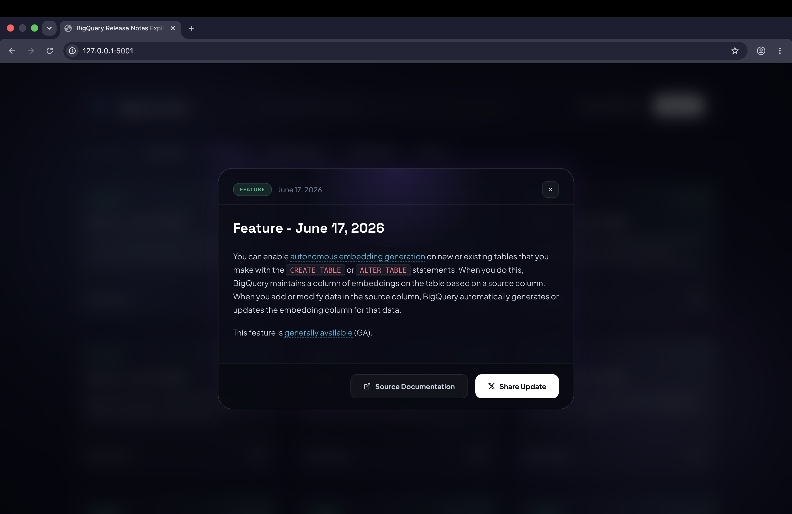

# BigQuery Release Notes Explorer 🚀

A modern, high-aesthetic single-page web dashboard designed with premium glassmorphic styling and fluid background animations. The application proxies and parses Google's official BigQuery Atom release feed, splits combined entries into distinct topic updates (Features, Announcements, Deprecations, Issues), and lets you share specific notes on X/Twitter with a single click.

---

## 📸 Screenshots

### Dashboard View


Browse categorized BigQuery release updates with real-time search, filtering, and a premium glassmorphic interface.


### Detailed Release Note Modal



Open any update to view complete release information, documentation links, and sharing options.

--
## ✨ Key Features

### 🎨 Premium Glassmorphism UI

- Obsidian-inspired dark theme
- Frosted glass containers using `backdrop-filter`
- Smooth hover animations and glow effects
- Responsive layout optimized for desktop and tablet

### 🌌 Animated Background Effects

- Multi-layer gradient blobs
- Continuous floating and blending animations
- Aurora-inspired visual design

### 🔍 Intelligent Release Note Processing

- Fetches Google's official BigQuery release feed
- Parses XML Atom entries
- Splits grouped updates into individual categorized items
- Automatically classifies Features, Announcements, Deprecations, and Issues

### ⚡ Interactive Experience

- Instant search filtering
- Category-based navigation chips
- Dynamic feed refresh
- Responsive card interactions

### 📄 Rich Detail Modal

- Fully rendered HTML content
- Inline links and formatted code snippets
- Direct access to Google Cloud documentation
- Elegant overlay presentation

### 🐦 X/Twitter Sharing

- One-click sharing
- Auto-generated tweet content
- Includes category, date, summary, and hashtags
---


## 🛠️ Technology Stack

*   **Backend**: Python 3, Flask (lightweight micro-framework for template rendering and API proxying)
*   **XML Parsing**: Python standard libraries (`xml.etree.ElementTree`, `urllib.request`, `ssl`)
*   **Frontend**: 
    *   **HTML5**: Semantic structure, templates, SVG icons
    *   **CSS3**: Custom variables, radial/linear gradients, responsive Grid/Flexbox layouts, keyframe animations
    *   **JavaScript (ES6+)**: Vanilla DOM manipulation, debounced input triggers, state-based routing

---

## 📁 File Structure

```text
bigquery-release-notes-app/
├── app.py                 # Flask server & XML parsing engine
├── templates/
│   └── index.html         # Frontend HTML structure & Modal
├── static/
│   ├── css/
│   │   └── style.css      # Custom Glassmorphic CSS design system
│   └── js/
│       └── app.js         # Client-side state, filters, and intent sharing
├── screenshots/
│   ├── dashboard.png      # Website screenshots
│   └── modal-view.png     
├── .gitignore             # Git exclusion rules
└── README.md              # Project documentation
```

---

## 🚀 Getting Started

### Prerequisites

Make sure you have Python 3.8+ installed on your computer.

### Installation

1.  **Clone the repository**:
    ```bash
    git clone https://github.com/ReshmanthSai/BigQuery-Release-Hub.git
    cd BigQuery-Release-Hub
    ```

2.  **Create a virtual environment**:
    ```bash
    python3 -m venv venv
    ```

3.  **Activate the virtual environment**:
    *   **macOS/Linux**:
        ```bash
        source venv/bin/activate
        ```
    *   **Windows (Command Prompt)**:
        ```cmd
        venv\Scripts\activate.bat
        ```

4.  **Install dependencies**:
    ```bash
    pip install flask
    ```

### Running the Application

1.  Start the local development server:
    ```bash
    python app.py
    ```

2.  Open your browser and navigate to:
    ```text
    http://127.0.0.1:5001
    ```

---

## 📜 License

This project is open-source and available under the [MIT License](LICENSE).
