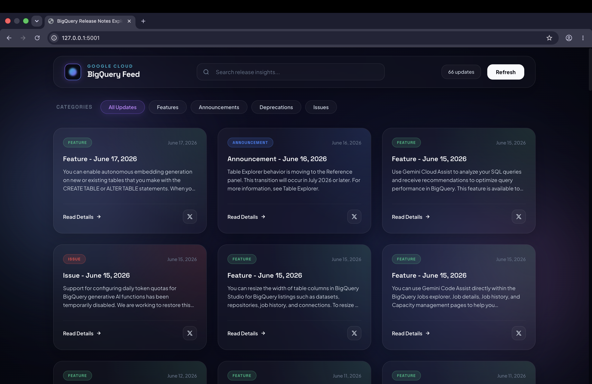

# BigQuery Release Notes Explorer 🚀

A modern, high-aesthetic single-page web dashboard designed with premium glassmorphic styling and fluid background animations. The application proxies and parses Google's official BigQuery Atom release feed, splits combined entries into distinct topic updates (Features, Announcements, Deprecations, Issues), and lets you share specific notes on X/Twitter with a single click.


---

## 📸 Screenshots

# Dashboard View

 

## ✨ Key Features

*   **Aurora Glassmorphism Styling**: Obsidian dark base featuring subtle `backdrop-filter: blur(24px)` glass containers, fine translucent borders, and custom glowing hover translation effects.
*   **Animated Backdrop**: Fluid, organic background gradients that slowly rotate, merge, and drift using CSS keyframe animations.
*   **Granular XML Feed Parsing**: Google's release feed aggregates multiple updates under single dates. The backend parses and splits these entries (e.g. separate Feature, Announcement, or Issue updates) so each topic gets its own card and unique sharing link.
*   **Interactive Search & Filters**: Instant debounced search filtering alongside dedicated category navigation chips.
*   **Dynamic UI Refresh**: Re-fetch the XML feed on command with a custom CSS loading spin state and button locking.
*   **Persistent Modal Sheets**: Click any card to trigger a centered, frosted overlay modal displaying fully-rendered rich HTML (links, lists, inline code blocks) and a direct link to Google Cloud's documentation.
*   **X/Twitter Intent Sharing**: Share any specific update with a pre-configured Web Intent popup that auto-populates the note's category, date, summary, URL, and hashtags.


---


## 🛠️ Technology Stack

*   **Backend**: Python 3, Flask (lightweight micro-framework for template rendering and API proxying)
*   **XML Parsing**: Python standard libraries (`xml.etree.ElementTree`, `urllib.request`, `ssl`)
*   **Frontend**: 
    *   **HTML5**: Semantic structure, templates, SVG icons
    *   **CSS3**: Custom variables, radial/linear gradients, responsive Grid/Flexbox layouts, keyframe animations
    *   **JavaScript (ES6+)**: Vanilla DOM manipulation, debounced input triggers, state-based routing

---

## 📁 File Structure

```text
bigquery-release-notes-app/
├── app.py                 # Flask server & XML parsing engine
├── templates/
│   └── index.html         # Frontend HTML structure & Modal
├── static/
│   ├── css/
│   │   └── style.css      # Custom Glassmorphic CSS design system
│   └── js/
│       └── app.js         # Client-side state, filters, and intent sharing
├── screenshots/
│   ├── dashboard.png      # Website screenshots
│   └── modal-view.png     
├── .gitignore             # Git exclusion rules
└── README.md              # Project documentation
```

---

## 🚀 Getting Started

### Prerequisites

Make sure you have Python 3.8+ installed on your computer.

### Installation

1.  **Clone the repository**:
    ```bash
    git clone https://github.com/ReshmanthSai/BigQuery-Release-Hub.git
    cd BigQuery-Release-Hub
    ```

2.  **Create a virtual environment**:
    ```bash
    python3 -m venv venv
    ```

3.  **Activate the virtual environment**:
    *   **macOS/Linux**:
        ```bash
        source venv/bin/activate
        ```
    *   **Windows (Command Prompt)**:
        ```cmd
        venv\Scripts\activate.bat
        ```

4.  **Install dependencies**:
    ```bash
    pip install flask
    ```

### Running the Application

1.  Start the local development server:
    ```bash
    python app.py
    ```

2.  Open your browser and navigate to:
    ```text
    http://127.0.0.1:5001
    ```

---

## 📜 License

This project is open-source and available under the [MIT License](LICENSE).
